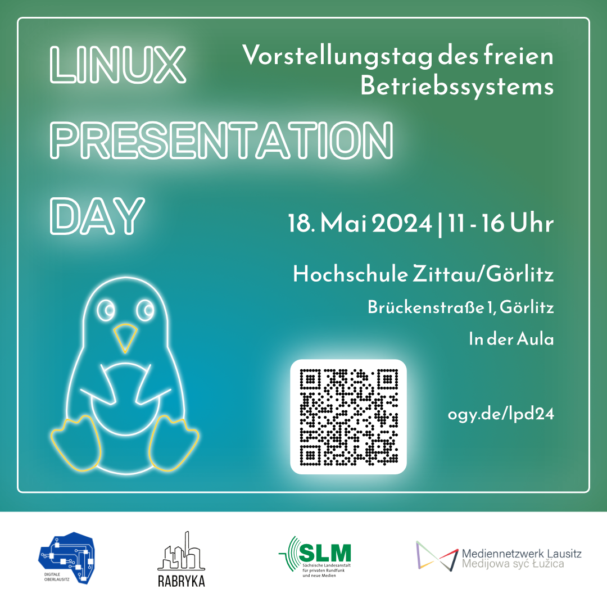

Am 18. Mai 2024 laden wir zum Linux Presentation Day ein.

Beim Linux Presentation Day erfahrt ihr, wie das Betriebssystem und sein OpenSource-Prinzip in der Praxis funktionieren,
warum so viele digitale Anwendungen darauf setzen und wie ihr euch selbst Linux auf den Rechner holt – damit eure
Computernutzung nicht nur sicherer sondern in vielen Punkten tatsächlich auch einfacher wird.

Der Linux Presentation Day findet seit einigen Jahren in [ganz Deutschland](https://l-p-d.org/de/lpd) statt.

In Görlitz wird die Schnuppermesse vom Digitale-Oberlausitz e.V., dem
[Rabryka-Projekt "Mediennetzwerk Lausitz" - gefordert von der SLM](https://www.rabryka.eu/veranstaltungen/detail/12358-Linux-Presentation-Day-2024)
sowie dem [Fachbereich Informatik der Hochschule Zittau/Görlitz](https://f-ei.hszg.de/startseite) organisiert.

Zeit:
18.05.2024 11:00 - 16:00 Uhr

Ort:
Hochschule Zittau/Görlitz - Aula ("Bluebox")  
Brückenstraße 1  
02826 Görlitz 

Der Eintritt ist frei  
Für Snacks und Getränke ist gesorgt

<!--more-->

# Programm

## Eröffnung und Einleitung

- Was ist Linux? Freie Software?
- Locale Community in Görlitz und Umgebung

## Vorstellung [Schulstick](https://fsfw-dresden.github.io/schulstick-page/)-Projekt

- Ein Linux speziell für Schulen

## Gaming unter Linux

- Computerspiele mit Linux

## NextCloud

- Dateien, Dokumente und Kalender im Internet speichern und mit anderen teilen, aber datenschutzfreundlich und
  unabhängig von Internet-Riesen

- Zielgruppe: Privatpersonen und Vereine

## Selber ausprobieren

- Kommen Sie ins Gespräch mit anderen Interessierten
- Ihre Fragen rund um Linux, Open-Source und weiteres
- Linux selbst ausprobieren
- Gaming unter Linux
- NextCloud
- Schul-Stick
- bringen Sie gerne Ihren eigenen Laptop mit und wir probieren Linux auf Ihrem Rechner

(Änderungen vorbehalten)
