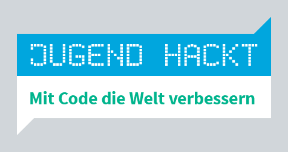

Sei dabei beim ersten Hackday in Görlitz!

Am 19. November von 10 bis 20 Uhr treffen sich in der Rabryka in Görlitz Jugendliche zwischen 12 und 18 Jahren, um
gemeinsam zu coden, zu tüfteln und gemeinsam Projekte zu entwickeln.

Egal ob Einsteiger, Einsteigerin oder Pro – alle sind willkommen und bei Bedarf unterstützen dich erfahrene Hacker und
Hackerinnen beim Coden! Außerdem erzählen Moderatoren und Moderatorinnen von ihrem Weg in die IT-Welt und vermitteln in
spannenden Workshops professionelle Einblicke in verschiedene Themenbereiche wie KI, Roboter-Programmierung oder Game
Design.

Du hast Lust bekommen? Dann melde dich kostenlos bis zum 5. November an!

[Link zur Anmeldung](https://anmeldung.jugendhackt.org/jh-dresden/Hackdaygoerlitz/)

Weitere Infos unter: https://jugendhackt.org/events/dresden/hackday-goerlitz
