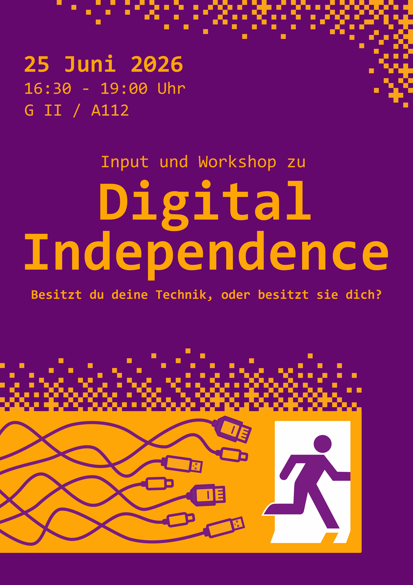

Am 25.06.2026 findet in Kooperation mit der Hochschule Zittau/Görlitz
eine Veranstaltung im Kontext "Digitale Souveränität" mit Fokus auf Social Media und
das Fediverse statt. 
Dabei wird es zunächst einen Vortrag zum Thema und anschließend auch die Möglichkeit zum umsetzen und ausprobieren geben.

Wir freuen uns auf euch!

Wann: 25. Juni 2026, 16:30 bis 19:00 Uhr.\
Wo: Hochschule Zittau/Görlitz, \
Campus Görlitz, \
GII Raum A112, \
Brückenstraße

