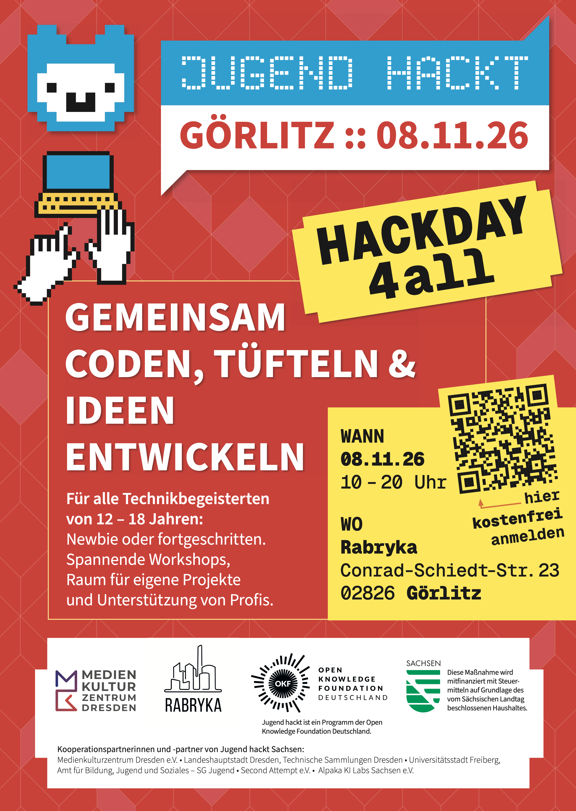
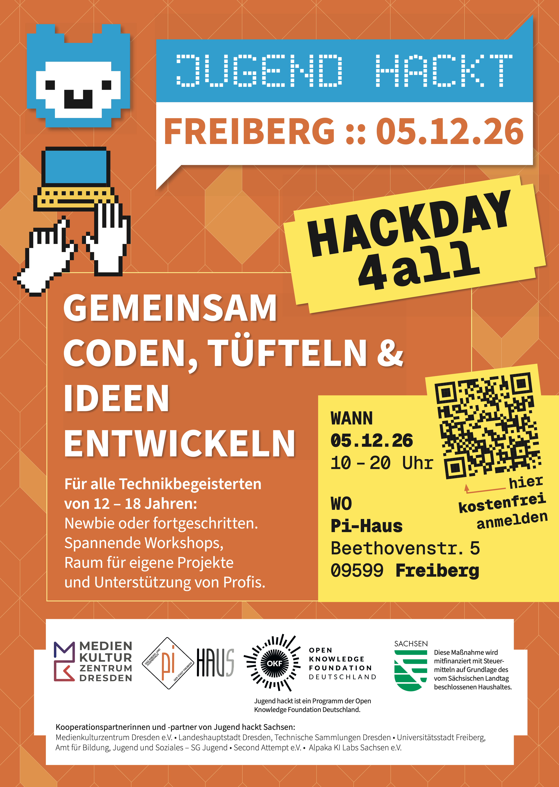

Am 08. November findet wieder der **Jugend Hackt - Hackday** in der Rabryka statt.
Das Motto ist "Gemeinsam Coden, Tüfteln & Ideen entwickeln".
Für alle Technikbegeisterten von 12 - 18 Jahren: Newbie oder fortgeschritten. 
Spannende Workshops, Raum für eigene Projekte und Unterstützung von Profis.

https://jugendhackt.org/events/dresden/hackday-goerlitz-2026/

Und falls ihr am 05.12. in Freiberg seid, könnt ihr dort ebenfalls beim Hackday mitmachen:
https://jugendhackt.org/events/dresden/hackday-freiberg-2026/

