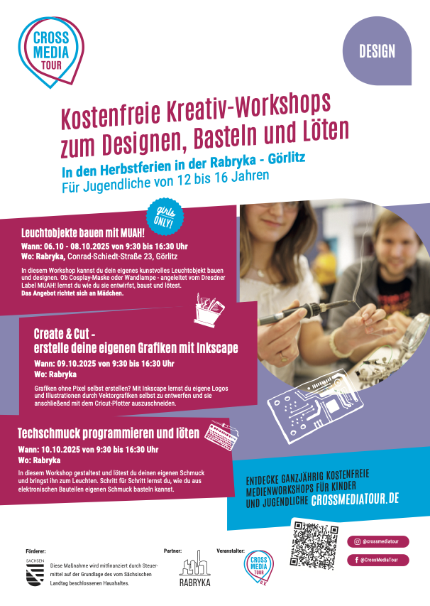
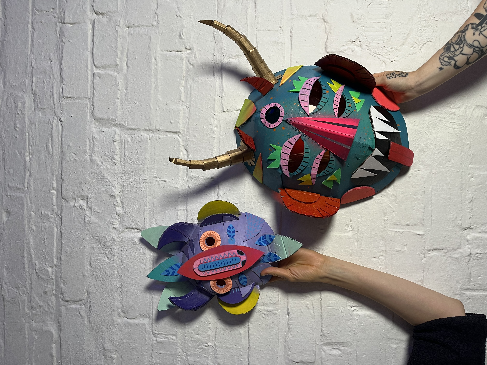
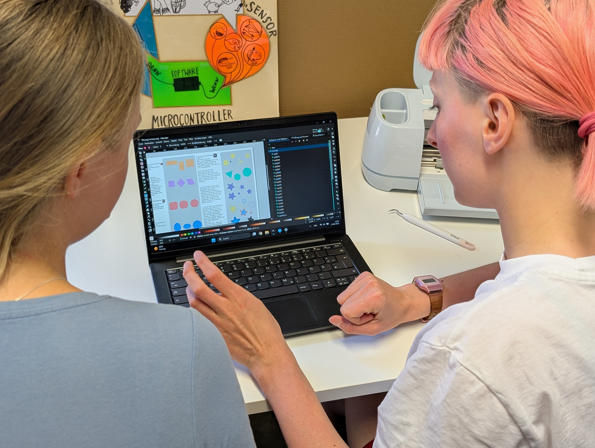

## Kostenfreie Kreativ-Workshops in der Rabryka

Ob Schmuck löten, Programmieren oder Masken designen – in den Herbstferien gibt es in der Rabryka in Görlitz spannende
Angebote nur für Jugendliche von 12 bis 16 Jahren.
Der CrossMedia Tour e.V. lädt zu drei kostenfreien Einsteiger-Workshops ein, die medienpädagogisch begleitet werden und
Technik spielerisch mit Kreativität verbinden.

<!--more-->

Drei Workshops – drei Chancen, Technik kreativ zu erleben:

### Leuchtobjekte bauen mit MUAH – Girls Only

06.–08.10.25 | Rabryka

Ob kunstvolle Maske oder leuchtendes Objekt – gemeinsam mit dem Dresdner Label MUAH entwirfst und baust du deine eigene
kreative Leuchtmaske.

### Create & Cut – erstelle deine eigenen Grafiken mit Inkscape

09.10.25 | Rabryka

Gestalte eigene Logos und Illustrationen als Vektorgrafiken und lass sie mit dem Cricut-Plotter direkt ausschneiden.

### Techschmuck programmieren und löten

10.10.25 | Rabryka

Schritt für Schritt lernst du, elektronische Bauteile zu verbinden und daraus leuchtenden Schmuck zu basteln.

## Anmeldung & Infos

Die Plätze sind begrenzt – es gilt first come, first serve. Anmeldung online unter: www.crossmediatour.de
Hier geht’s [zu den Kursen in Görlitz](https://crossmediatour.de/crossmediatour-goes-minkt/).

Verpflegung ist inklusive, alle Ergebnisse dürfen mit nach Hause genommen werden und auch Anreisekosten können
übernommen werden.

