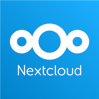

Seit ihr ein gemeinnütziger Verein oder Initiative und habt Interesse an Nextcloud, jedoch braucht ihr Hilfe bei der
Einrichtung oder wünscht euch einen Erfahrungsaustausch? Dann nehmt bitte bis spätestens 10.01.2026 an dieser Umfrage
teil:

https://nextcloud.digitale-oberlausitz.eu/apps/forms/s/WHfTggTkiPrEYZJgCKq58q3f

# Worum geht es?

Vereinsarbeit findet heutzutage fast immer auch im digitalen Raum statt, sei es bei der Kommunikation der Mitglieder
untereinander, beim Erstellen und Verwalten von Dokumenten oder der Koordination von Aufgaben. Hier sind Cloud-Angebote
von US-Amerikanischen Digitalkonzernen wie Google-Docs eine vermeintlich schnelle und einfache Lösung. Jedoch haben
viele Vereine berechtigte Zweifel und Vorbehalte gegen diese Angebote: sei es aus Datenschutzgründen oder aus Sorge vor
zu großer Abhängigkeit von US-Konzernen vor dem Hintergrund der aktuellen politischen Entwicklungen in den USA.

[Nextcloud](https://nextcloud.com/) ist eine freie Open-Source-Software, die unabhängig von Konzernen von einer großen
Zahl von Freiwilligen
entwickelt wird. Nextcloud kann entweder auf einem eigenen Server selbst betrieben, oder bei einem (deutschen) Anbieter
für kleines Geld angebietet werden. In jedem Fall haben Nutzende die Hoheit über ihre eigenen Daten. Nextcloud eignet
sich sowohl im privaten Umfeld, z.B. zum Austausch von Familienfotos als auch für kleine und mittlere Unternehmen und
eben auch für Vereine.

Wir setzen bei uns im Verein seit einigen Jahren Nextcloud ein, sind aber sicher keine Profis. Wir haben positive und
auch negative Erfahrungen gemacht und wollen uns gerne mit anderen Vereinen oder sonstigen Interessierten austauschen.
Wir haben von mehreren Seiten Interesse am Thema "Vereinssoftware" vernommen und wollen deshalb nun einen Austausch zu
diesem Thema organisieren.

Im ersten Schritt geht es darum, das Interesse und die Bedarfe von Vereinen in der Region und den aktuellen Stand zu
erfragen.
Was benutzt ihr bisher? Warum wollt ihr wechseln? Und welche Hürden und Probleme seht ihr?
Die Anfrage richtet sich sowohl an Vereine, die bereits Nextcloud oder
ähnliche Software nutzen, als auch an solche, die aktuell (noch) mit Google-Docs und co arbeiten oder die noch garnicht
digital arbeiten und sich einfach nur für das Thema interessieren. Wenn ihr Interesse habt, füllt doch bitte
diese [Umfrage](https://nextcloud.digitale-oberlausitz.eu/apps/forms/s/WHfTggTkiPrEYZJgCKq58q3f) (mit Nextcloud
erstellt ;-)) bis zum 10.01.2026 aus.

Je nach dem, wie die Rückmeldungen aussehen, wollen wir Workshops oder andere Formate organisieren um möglichst vielen
Vereinen die Nutzung von Nextcloud zu ermöglichen.
