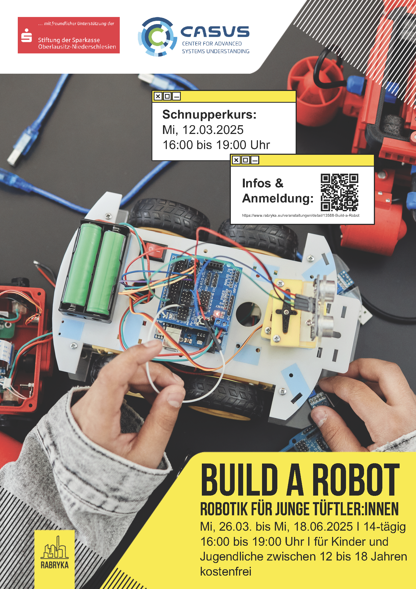

Wir möchten auf eine praktische Veranstaltung eines Partnervereins aufmerksam machen: 

**Build A Robot - Schnupperkurs**

Tauche ein in die Welt der Robotik! In einem praxisorientierten Kurs entwickelst du Schritt für Schritt deinen eigenen Roboter und tauchst dabei in verschiedene Bereiche der Robotik ein:

**Schwerpunkte**

* Antrieb & Bewegung
* Smarte Fernsteuerung
* Sensorik & Umgebungswahrnehmung
* KI & Objekterkennung

Wann: 12. März 2025

Uhrzeit: 16:00 - 19:00 Uhr

Veranstalter: [Second Attempt e. V.](https://www.rabryka.eu/verein.html)

Anmeldung: https://www.rabryka.eu/veranstaltungen/detail/13569-Build-a-Robot-Schnupperkurs