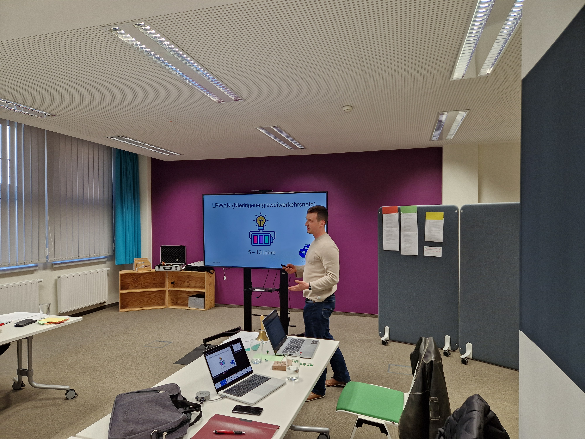
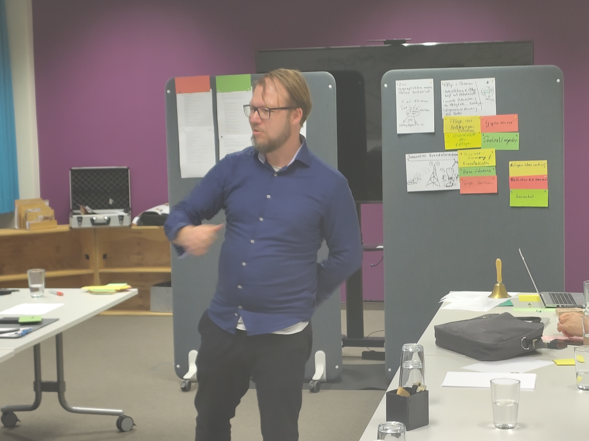

Was hat LoRaWAN mit IoT und Pflegebetten zu tun? Und warum beschäftigen wir uns überhaupt damit?

Das Veranstaltungsformat Magellan 4.0 will einen Ort und eine Situation schaffen, in der kreative IT-Leute aus Forschung und Wirtschaft oder privtem Umfeld in den Austausch gehen und Technologien und Konzepte mit Potential betrachten. Ein solches Thema ist LoRaWAN - "Low Range Wide Area Network": Eine Netzwerktechnologie, die als Alternative bzw. Ergänzung zu klassischen Netzwerk-Stacks mit TCP/IP und WLAN völlig andere Szenarien ermöglicht oder diese deutlich kostengünstiger umsetzbar machent.

Am 8. April fanden wir uns zum allerersten Treff des interaktiven Austauschformats "Magellan 4.0" mit 17 Leuten im *Engery Business & Event Space* zusammen und hatten eben LoRaWAN als Thema für dieses mal ausgewählt. Wir konnten unsere Ideen zur Gestaltung des Autausches sehr gut umsetzen:

Pawel Adaszewski hat hat einen sehr anschaulichen Einblick in die Technik hinter LoRaWAN gegeben. Es konnten viele Fragen im Tech-Talk geklärt werden.

<!--more-->

Doch damit konnten wir uns dann mit einem gemeinsamen Verständnis über Anwendungsfälle unterhalten und viele interessante Beispiele konstruieren. Es ist doch erstaunlich, wie man so mit ein paar Sensoren und Aktoren im Kontext IoT praktische Anwendunge bauen könnte, die das alltägliche Leben betreffen. Sicherlich waren nicht alle Beispiel bis zum Ende durchdacht und nichtzuletzt ging es auch darum, einfach mal ohne Beschränkungen in eine Erfinderlaune zu kommen und auch mal völlig absurde Ideen zu "spinnen". Denn nur so kommt man letztlich auch mal auf außergewöhnliche Ansätze und Ideen - so haben es David Sauer und Tino Schmidt vom [GAT-Institut](https://gat.hszg.de) der Hochschule Zittau/Görlitz konzipiert. 

In einer Art interaktivem Spiel haben wir Ideen entwickelt, wie bspw. Verbesserung der Betreuung von zu pflegenden Menschen mit reaktiven Pflegebetten, die die aktuelle Aktion des Patienten erkennen und unterstützen sollen (Aufstehen, Hinsetzen), oder bspw. auch Exoskellette, die das Pflegepersonal in hebenden Tätigkeiten entlasten könnten.

Von den Teilnehmenden haben wir am Ende noch einige Verbesserungsvorschläge eingesammelt und wollen diese Hinweise direkt in die 2. Veranstaltung einfließen lassen. Der nächste Magellan-Treff ist noch nicht endgültig terminiert; doch in etwa wird dieser im Juli stattfinden. Das Thema ist bis dahin noch offen und wir sind gespannt auf Rückmeldungen und Wünsche (an mailto:magellan@digitale-oberlausitz.eu). Denn letztlich soll das Thema von dem Kreis der Teilnehmenden und der IT-Communinty der Oberlausitz kommen. ;-)
