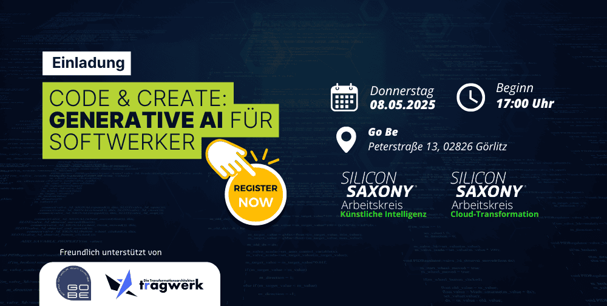

Wir möchten auf eine praktische Veranstaltung eines Partnervereins aufmerksam machen: 

**Silicon Saxony goes Görlitz - Code & Create: Generative AI für Softwerker**

Am 8. Mai kommen die Arbeitskreise Künstliche Intelligenz und Cloud-Transformation mit einem spannenden Format nach Görlitz:

**Schwerpunkte**

* Impulsvortrag: GenAI als Productivity Booster im Software Engineering?
* mpulsvortrag: Digitale Souveränität mit Open Source KI: Potenziale und Praxis
* WordlCafé: In der Gruppenarbeit vertiefen wir die Impulsvorträge und fördern moderiert den Austausch.
* Netzwerken bei Snacks & Getränken

Wann: 08. Mai 2025, 17:00 Uhr
Wo: Peterstra0e 13, 02826 Görlitz

Veranstalter: [Silicon Saxony e.V.](https://silicon-saxony.de/)

Mehr Details: https://silicon-saxony.de/sisax-events/silicon-saxony-goes-goerlitz-code-create-generative-ai-fuer-softwerker/