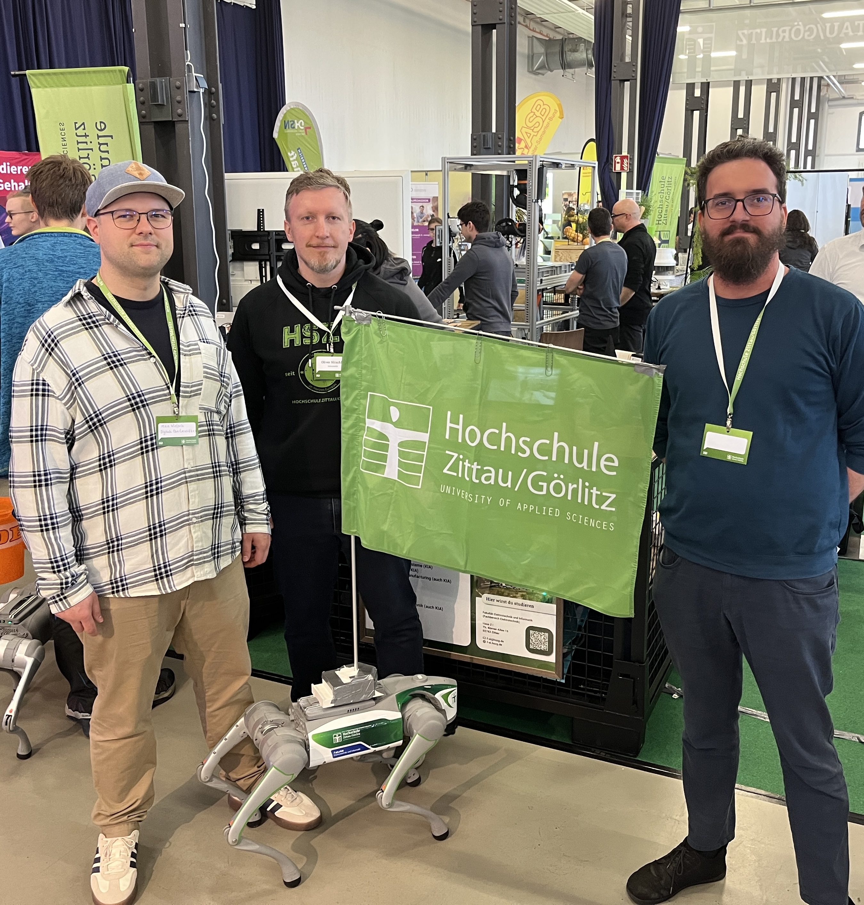

Beim [Insider-Treff in Löbau](https://www.loebau.de/freizeit-und-tourismus/veranstaltungsinformation/veranstaltungskalender/insidertreff-2026/) stellen sich jedes Jahr diverse Firmen und Institutionen vor, insbesondere um jungen Menschen
zu zeigen, welch abwechlsungsreiche Unternehmen und vielfältige Ausbildungsmöglichkeiten es in der Region gibt.
Wir waren als Verein am 09.05. ebenfalls vor Ort und haben am Stand der Hochschule Zittau/Görlitz beim Fachbereich Informatik 
unterstützt. Dabei haben wir zum Einen in diversen Gesprächen unsere Perspektive als Alumni der Hochschule und unseren Blick aus 
der Praxis dargestellt. Zum Anderen haben wir über unsere gemeinnützige Arbeit im Bereich Bildung zu Digital-Themen berichtet.

Daneben haben wir auch aktiv den Kontakt zu verschiedenen Handwerksbetrieben aus der Region gesucht und über den Bedarf 
an Digitalisierung in den Unternehmen und den nötigen digitalen Fähigkeiten von Auszubildenden gesprochen.

